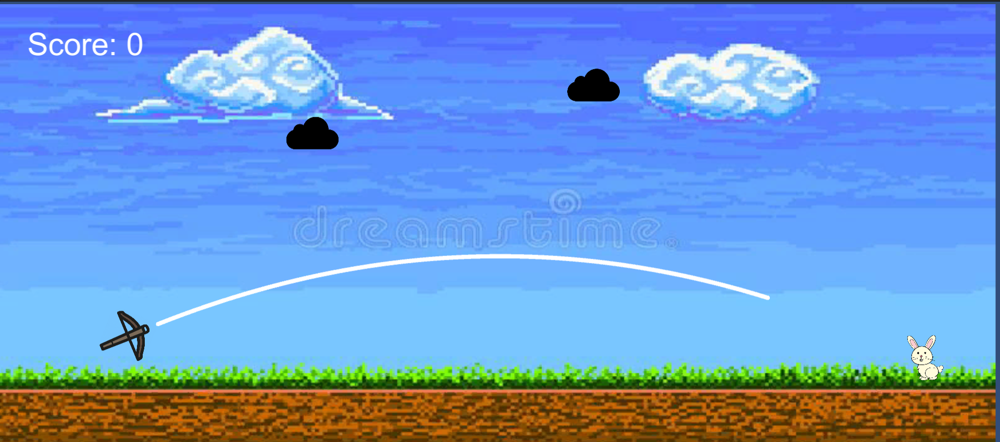
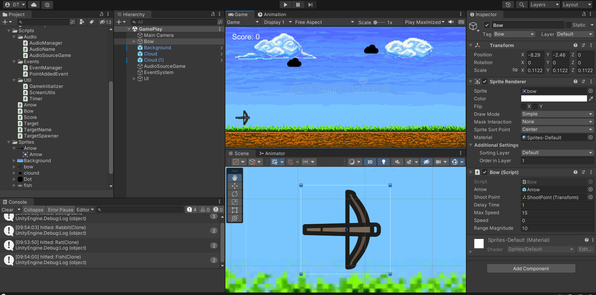
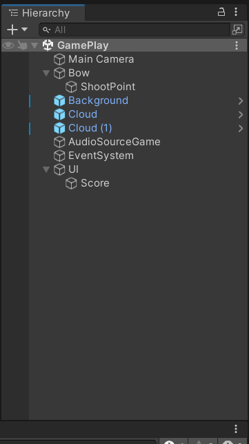
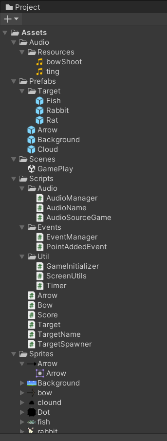

# Angry Para Shoot

## Table of Contents
- [Description](#description)
- [Preview Screenshot](#preview-screenshot)
- [Technology](#technology)
- [Contributors](#contributors)
- [License & Copyright](#license--copyright)

## Description
- This is a mini project shooting game
- Click and drag to shoot (Like angry bird)
- New random targer will drop if you hit a target
- Try this game at:

## Preview Screenshot

  
  </img> &nbsp;&nbsp; 
  </img> &nbsp;&nbsp; 
  </img> &nbsp;&nbsp;
  </img> &nbsp;&nbsp;
  

  
## Technology
  - UnityEngine 
  - C#
  - RayCast
  - Using physics formulas

## Contributors
- [Tran Minh Thien](https://github.com/Denkhotieu) - SE160413 

## License & Copyright
&copy; 2022 TranMinhThien.
